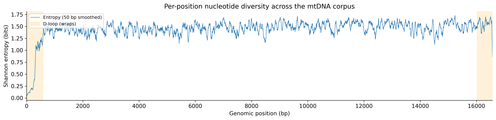
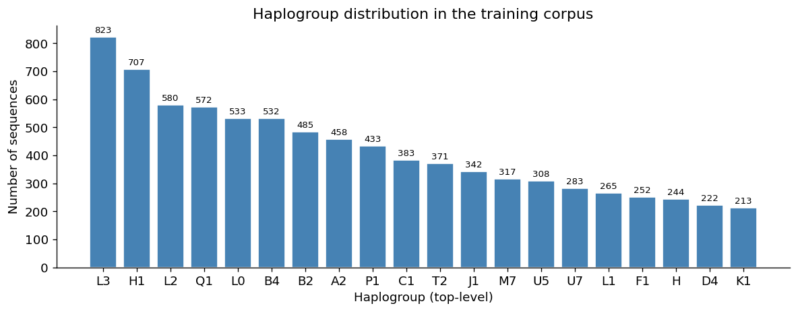

# This Genome Has 16,569 Base Pairs and Runs on Different Rules

Position 1 and position 16,569 of mitochondrial DNA share a phosphodiester bond. They are physically adjacent. The genome is a circle, so the last base connects directly back to the first.

This sounds like a minor structural detail. It is not. It is one of the first things that breaks when you try to apply standard sequence models to mitochondrial DNA, and it is the reason I am building something new rather than fine-tuning an existing model.

---

## The circular topology problem

Human nuclear DNA is a linear sequence. Chromosomes have defined ends. When a model assigns positional encodings, position 0 is one end and position N is the other, and distance is just subtraction.

mtDNA has no ends. Imagine removing the end-caps from a chromosome and joining the two loose ends into a ring. The molecule is 16,569 base pairs long, circular, and double-stranded. In the cell, it floats as a supercoiled ring in the mitochondrial matrix.

The D-loop control region makes the topology problem concrete. The D-loop spans approximately positions 576 to 16,024, which sounds strange until you realise it wraps around the junction point at position 16,569/1. Both the heavy-strand promoter and the light-strand promoter are in this region. So is the origin of heavy-strand replication. The D-loop is functionally unified, but positions 16,024 and 576 are at opposite ends of a linearised sequence.

I measured entropy across 34,975 human mitochondrial sequences used from HmtDB. The D-loop region shows approximately 7x higher per-position entropy than protein-coding regions. It is where most haplogroup-defining variation sits. It is also where any linear model would introduce a discontinuity.

Standard transformer positional encoding places positions 0 and 16,568 as maximally distant in embedding space. DNABERT2, HyenaDNA, Nucleotide Transformer: all three use linear positional encoding. None of them have a mechanism to represent the fact that these positions are physically adjacent and functionally connected through a shared regulatory element.

---

## Heteroplasmy

Every biology textbook describes diploid inheritance: two copies of each nuclear chromosome, one from each parent. Mitochondria do not work this way.

A typical human cell contains somewhere between 100 and 10,000 mitochondria. Each mitochondrion contains multiple copies of the mitochondrial genome. That is hundreds to thousands of mtDNA molecules per cell. And they are not necessarily identical.

Heteroplasmy is the state where a cell carries two or more genetically distinct versions of mtDNA simultaneously. At every position in the genome, you can ask: what fraction of the copies carry the reference allele? What fraction carry the variant? That fraction is the heteroplasmy level, and it is a continuous value between 0 and 1.

The clinical consequences depend critically on this fraction. Consider the m.3243A>G mutation in the MT-TL1 gene, which encodes a mitochondrial transfer RNA. At low heteroplasmy levels, the mutation is often asymptomatic or produces mild symptoms. Above roughly 70-80% heteroplasmy, it causes MELAS: mitochondrial encephalomyopathy, lactic acidosis, and stroke-like episodes. Same mutation, same position, different outcome depending on a number between 0 and 1.

Standard DNA sequence models accept a discrete input: one base at each position. They have no architecture for a continuous per-position value. The heteroplasmy channel is simply not in the interface. This is not a training data problem. It is a model design problem.

I built a heteroplasmy projection channel into the model architecture: a separate input tensor of shape (batch, sequence_length) carrying per-position float values, projected into the embedding space before the transformer layers. The idea is that the model can learn to weight sequence features differently depending on the local heteroplasmy signal.

---

## The information density problem

mtDNA is strictly maternally inherited. It does not recombine. Every human alive today inherited their mtDNA from their mother, who inherited it from her mother, in an unbroken chain extending back approximately 300,000 years to a single female ancestor.

This has a consequence for the sequence data. Mutations accumulate in mtDNA at a roughly constant rate, and they never get shuffled by recombination. The genealogical relationship between any two sequences is a tree. Sequences cluster into haplogroups based on shared derived mutations. L clades are the oldest, rooted in sub-Saharan Africa. M and N macrohaplogroups expanded out of Africa approximately 60,000-70,000 years ago. H, V, J, T, and a dozen others mark the later expansion into Europe and Western Asia. B, A, C, and D trace the peopling of East Asia and the Americas.

For a foundation model, this structure is a pre-training signal. The sequences carry explicit phylogenetic information. If the model learns good representations, haplogroup separation should emerge zero-shot before any fine-tuning. I tested this: zero-shot k-NN classification on the pre-trained encoder reaches approximately 50% accuracy on an 8-class haplogroup verification panel, against a random baseline of 12.5% (4× lift). The pre-training signal is real.

But the dataset structure is non-trivial. The HmtDB corpus (34,975 sequences used out of 47,000 total) is 60-70% European. Haplogroup H alone represents roughly 40-45% of European populations. A model trained naively on this corpus will have dense, well-separated representations for H, HV, J, and T, and sparse representations for the L clades and the Asian-specific lineages. Haplogroup balance is a genuine concern for any downstream application in population genetics or clinical genetics outside European ancestry groups.

---

## Why this project exists

I checked the existing models before starting. The question was: can I fine-tune DNABERT2, HyenaDNA, or Nucleotide Transformer on mtDNA, or do I need to build something new?

All three use linear positional encoding. None handle the D-loop discontinuity. None have a heteroplasmy channel. All three were primarily trained on nuclear DNA, which has fundamentally different base composition, gene density, and intron/exon structure compared to the compact, intron-free, extremely gene-dense mitochondrial genome. Fine-tuning on mtDNA would mean the model inherits a flawed inductive bias for the circular topology, ignores the continuous per-position heteroplasmy signal entirely, and starts from representations calibrated to a very different genomic context.

The reasonable conclusion is that a dedicated architecture is warranted. Not necessarily a large one. The 6-layer BERT encoder I am building has 256 hidden dimensions and approximately 5.8 million parameters. Small enough to pre-train on a laptop, large enough to learn sequence structure at the 6-mer level across 16,569 positions.

The three features that make this a different model rather than a fine-tuned existing one: circular positional encoding (positions wrap, so distance between position N-1 and position 0 is 1, not N-1), a heteroplasmy projection channel in the input, and pre-training exclusively on mitochondrial sequences so the base representations are calibrated to this specific genomic context.

---

## What I am building

A 6-layer BERT encoder with circular positional encoding, a heteroplasmy input channel, and pre-training on 34,975 human mtDNA sequences plus cross-species vertebrate sequences for Phase 1. Fine-tuning tasks: haplogroup classification (26 classes), pathogenic variant prediction, and heteroplasmy regression.

The pre-training is running. The architecture is working. The zero-shot results are not zero.

Next: I want to understand whether the existing model landscape could handle this at all, or whether the problems I described above are genuinely architecture-level failures rather than training-data problems. That analysis is in the next post.
<!-- published: https://rokpayprsizors.wordpress.com/2026/06/06/this-genome-has-16569-base-pairs-and-runs-on-different-rules/ -->
