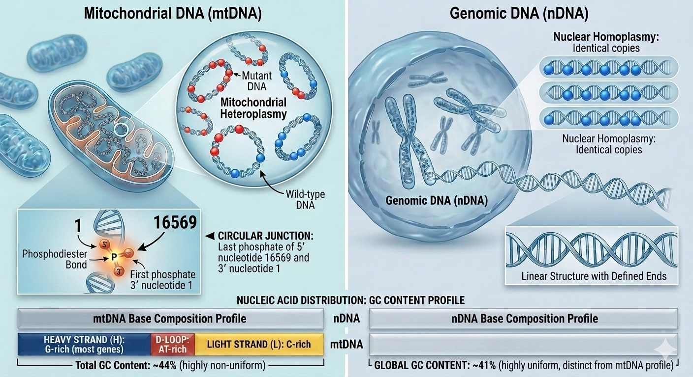

# I Checked Whether Existing DNA Models Could Handle Mitochondrial DNA. Here's the Problem.

Before writing a single line of model code, the honest question to ask is: does a new model actually need to exist?

DNA foundation models are not rare. DNABERT2 was trained on multi-species genomes and handles variable-length sequences. HyenaDNA processes sequences up to 1 million base pairs with sub-quadratic attention. Nucleotide Transformer used 850 billion nucleotides from across the tree of life. These are not toy systems. If any of them can be fine-tuned on mitochondrial DNA without architectural modification, that is the right path.

I spent time checking whether that is true. The answer is no, and the reasons are specific enough to be worth writing out.

---

## What these models assume

All three models treat DNA as a linear sequence. That is not a criticism: nuclear DNA is linear. Chromosomes have telomeres at each end and centromeres in the middle, and the sequence proceeds from position 1 to position N with nothing connecting N back to 1.

Standard transformer positional encoding assigns each position a vector. The vectors are designed so that nearby positions have similar encodings and distant positions have dissimilar encodings. DNABERT2 uses rotary positional embeddings. HyenaDNA uses learned absolute positional embeddings. Nucleotide Transformer uses standard sinusoidal absolute positional embeddings. The specific implementation differs, but the underlying assumption is the same: sequences have ends, and distance is defined by the gap between indices.

All three models also accept a single discrete base (or k-mer) at each position. Input is one sequence, output is one representation. There is no mechanism for per-position continuous values. And all three were trained primarily on nuclear DNA. The genomic context they have calibrated their representations to: long sequences with introns, regulatory elements spread across megabases, repetitive elements, and GC content and base composition distributions characteristic of nuclear chromosomes.

Mitochondrial DNA is different on all of these axes simultaneously.

---

## The circular junction failure

mtDNA is 16,569 base pairs long and circular. Positions 1 and 16,569 share a phosphodiester bond. They are adjacent.

For a model using linear positional encoding, position 0 and position 16,568 are maximally distant. The positional embeddings for these two positions are designed to be as dissimilar as possible. If you hand a standard transformer a linearised mtDNA sequence, it encodes the relationship between position 1 and position 16,569 as a separation of 16,568 steps.

The D-loop control region sits directly at this junction. The D-loop spans approximately positions 576 to 16,024, wrapping across the position-1/position-16,569 boundary. Both promoters for transcription and the origin of heavy-strand replication are in this region. The functional unit straddles the place where linearisation creates a gap.

What this means for attention: in the pre-trained representations, attention heads that learn to focus on functionally related positions in the D-loop would need to attend across the full sequence length. Sequence 1 (position 576) and sequence 2 (position 16,024) look like they are separated by most of the genome, when they are actually adjacent regulatory elements. The attention pattern for the D-loop region would be structurally incorrect in any model with linear positional encoding.

For haplogroup classification, D-loop variants are the primary discriminating features between haplogroups. Getting the D-loop wrong is not a peripheral failure.

---

## The heteroplasmy problem

Standard sequence models produce one output for one input. You pass in a sequence of bases, and the model produces an embedding or a set of token-level predictions.

Heteroplasmy requires a different interface. The same cell can carry two versions of the same mtDNA molecule in different proportions. The proportion matters clinically. For the m.3243A>G mutation, the patient may be asymptomatic below roughly 40% heteroplasmy and have full-blown encephalomyopathy above 70-80%. The variant is not present or absent. It is present at a fraction, and that fraction is the key variable.

A model that takes one sequence as input and produces one prediction is asking the wrong question. The correct input is a reference genome plus a per-position float vector indicating the fraction of copies carrying a non-reference allele. The model needs to learn: what does this sequence context, combined with this heteroplasmy level at this position, mean for gene expression, pathogenicity, or phenotype?

DNABERT2, HyenaDNA, and Nucleotide Transformer have no input channel for this. The interface literally does not exist. You cannot add it by fine-tuning. You would need to modify the embedding layer to accept the additional continuous input and retrain from scratch, or at minimum from a checkpoint, on data that includes heteroplasmy annotations.

This is an architecture problem, not a pre-training data problem. Fine-tuning cannot fix it.

---

## Training distribution mismatch

Even setting aside topology and heteroplasmy, the pre-training distribution matters.

Nuclear DNA has a GC content of roughly 41%. Human mtDNA has a GC content of roughly 44%, but the distribution across the mitochondrial genome is highly non-uniform: the heavy strand (which contains most genes) is G-rich, while the light strand is C-rich. The D-loop is exceptionally AT-rich. The base composition profile of mtDNA is unlike nuclear DNA.

More importantly: human mtDNA protein-coding genes have no introns. All 13 protein-coding genes are encoded as continuous reading frames, no splicing, no non-coding interruptions within gene bodies. Nuclear DNA is mostly non-coding. The gene density and local sequence structure are fundamentally different.

The 6-mer vocabulary shifts as a result. Common 6-mers in nuclear non-coding regions appear rarely in compact mitochondrial coding regions. The pre-training distribution that DNABERT2 and Nucleotide Transformer learned from human nuclear DNA does not match the distribution of tokens a model will see when processing mtDNA.

Fine-tuning can adjust for distribution mismatch, in principle. But the adjustment required is large enough that you are essentially asking the model to unlearn a substantial fraction of what it learned. And you are doing that while keeping an architecture that structurally misrepresents the circular topology and lacks the heteroplasmy channel. The inherited problems do not go away.

---

## The conclusion

The three architecture-level failures I described are not addressable by fine-tuning:

1. Linear positional encoding cannot represent circular adjacency. The relationship between positions 1 and 16,569 is structurally wrong in any model using linear PE, and no amount of fine-tuning on mtDNA data will correct the encoding itself.

2. There is no heteroplasmy input channel. Fine-tuning cannot add an input tensor that does not exist in the model's interface.

3. The pre-training distribution is calibrated to nuclear DNA. This is the only problem that fine-tuning directly addresses, but it would need to overcome two other structural failures to produce a useful model.

Building from scratch is the right choice. The model does not need to be large. A 6-layer BERT encoder at 256 hidden dimensions is ~5.8 million parameters, small enough to pre-train on a laptop over a few days, large enough to capture 6-mer patterns across the 16,569 bp circular genome.

The two non-standard components are: circular positional encoding (distance between positions wraps at the genome boundary, so pos 0 and pos 16,568 have a distance of 1, not 16,568) and a heteroplasmy projection channel in the input embedding layer. Everything else is standard BERT.

Whether these two additions are worth the cost of not inheriting a large pre-trained checkpoint is the real question. The zero-shot experiments answer it — see the update below.

*Update (bioRxiv preprint):* DNABERT-2 was evaluated on the same zero-shot 5-NN haplogroup task. DNABERT-2 (117M parameters) scores 66.3% (Macro-F1 0.659). mtDNA-FM (5.8M parameters) scores 37.9% (95% CI 34.4–41.2%). The overall 28.4 percentage-point gap favors DNABERT-2 for most haplogroups. However, mtDNA-FM outperforms DNABERT-2 on haplogroups C (F1 0.632 vs 0.611), F (F1 0.716 vs 0.613), and E (F1 0.400 vs 0.222), all haplogroups whose diagnostic positions fall beyond DNABERT-2's 3,000 nt processing window — the first empirical confirmation that full-genome circular encoding provides a measurable advantage exactly where the topology argument predicts it should.
<!-- published: https://rokpayprsizors.wordpress.com/2026/06/06/i-checked-whether-existing-dna-models-could-handle-mitochondrial-dna-heres-the-problem/ -->
