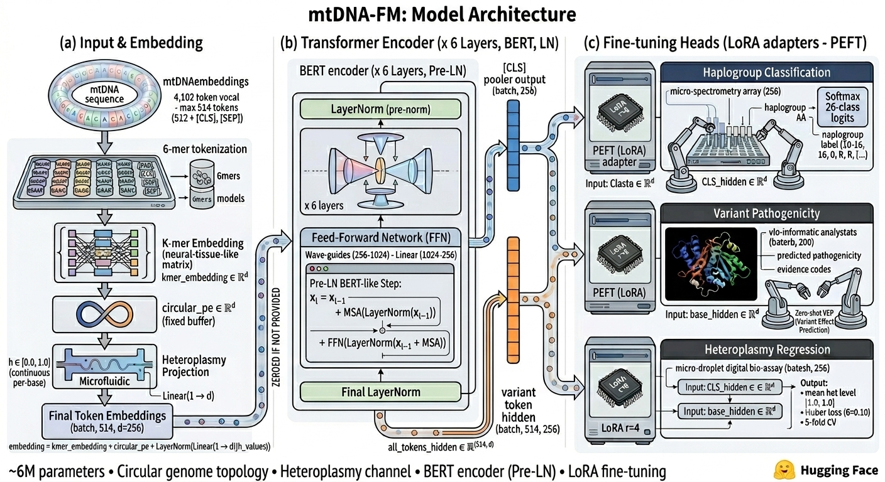
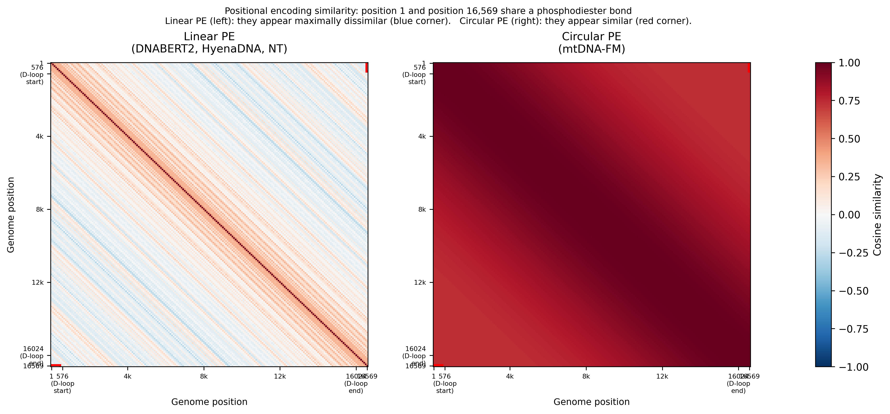
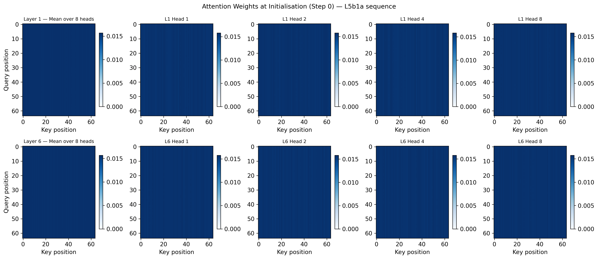

# Three Architecture Decisions I Made for mtDNA-FM and Why Each One Was Non-Obvious

The core design question for this project is: how do you represent a circular genome with continuous heteroplasmy data using a standard BERT-style encoder? Each answer I settled on replaced something more obvious that I initially considered. Here are the four decisions that shaped the model, and what each one cost and gained.

---

## The Starting Point

mtDNA-FM is a 6-layer BERT encoder, 8 attention heads, 256 hidden dimensions, approximately 5.8M parameters total. The vocabulary is 4,102 tokens: 4,096 6-mers plus 6 special tokens. If you squint, it looks like a small BERT.

But three structural choices make it different from anything I could have downloaded off the shelf. None of them were obvious upfront.



---

## Decision 1: Circular Positional Encoding

Standard BERT's sinusoidal positional encoding computes:

```
PE[pos, 2i]   = sin(pos / 10000^(2i/d))
PE[pos, 2i+1] = cos(pos / 10000^(2i/d))
```

For a linear sequence, this works correctly. Position 0 and position 16,568 are treated as maximally far apart. That is the right answer for a chromosome arm. It is the wrong answer for a circular molecule.

The human mitochondrial genome is 16,569 base pairs, and position 16,569 is physically adjacent to position 1. They share a phosphodiester bond. The D-loop control region, which contains the primary replication and transcription initiation sites, spans this junction: it runs from roughly position 16,024 to position 576, crossing the boundary that standard BERT treats as maximally distant.

If you use standard sinusoidal PE on mtDNA, any attention head trying to model D-loop regulation is working with a corrupted positional signal. The two halves of the D-loop look positionally unrelated when they are genomically adjacent.

The fix is one substitution. Replace the linear angle with a circular one. The difference shows clearly in the positional similarity matrix:




```python
class MtDNACircularPositionalEncoding(nn.Module):
    def __init__(self, genome_length: int, hidden_size: int):
        super().__init__()
        pe = torch.zeros(genome_length, hidden_size)
        position = torch.arange(genome_length).float()
        angle = 2 * torch.pi * position / genome_length
        div_term = torch.exp(
            torch.arange(0, hidden_size, 2).float() *
            (-math.log(10000.0) / hidden_size)
        )
        pe[:, 0::2] = torch.sin(angle.unsqueeze(1) * div_term)
        pe[:, 1::2] = torch.cos(angle.unsqueeze(1) * div_term)
        self.register_buffer("pe", pe)
```

The key change: `pos / 10000^(2i/d)` becomes `(2*pi*pos/16569) / 10000^(2i/d)`. At `pos = 0` and `pos = 16569`, the circular angle is 0 and 2*pi respectively. Since `sin(0) = sin(2*pi)` and `cos(0) = cos(2*pi)`, those two positions are positionally identical in the encoding. The junction is smooth.

I considered two alternatives. First, learnable positional embeddings, which most modern transformers use. The problem is that the circular topology is not a statistical pattern in the training data. It is a biological fact about the physical structure of the molecule. A learned embedding could approximate it, but it could also drift away from it during fine-tuning or get partially overwritten by a LoRA adapter. The second option was to just use standard sinusoidal PE and hope the attention mechanism would learn to compensate. That seemed like asking the model to learn what the encoding should have told it directly.

I made the encoding non-learnable by registering it as a buffer. It cannot be modified by gradient updates. It is also fully interpretable: given any position, you can compute its encoding analytically without running the model.

---

## Decision 2: Heteroplasmy Projection Channel

Heteroplasmy is the state where cells carry two or more versions of the mitochondrial genome simultaneously. In most tissue, mtDNA mutations are either absent or present in every copy. But in heteroplasmic conditions, the fraction of mutant copies varies continuously from 0.0 to 1.0.

The clinical relevance is direct. MELAS syndrome (mitochondrial encephalomyopathy, lactic acidosis, and stroke-like episodes) is caused by the m.3243A>G mutation. Below roughly 40% heteroplasmy, most carriers are asymptomatic. Above 80%, the condition is severe. The same mutation at the same genomic position has completely different clinical meaning depending on a float.

You cannot encode this as a sequence property. The k-mer at position 3243 is identical regardless of whether heteroplasmy is 0.1 or 0.9. There is nothing in the nucleotide sequence that carries this information. It has to come in through a separate channel.

I considered discretizing heteroplasmy into bins: 0-10%, 10-20%, and so on. The problem is that the boundaries are arbitrary, and the resolution loss near threshold boundaries (like the 40% MELAS threshold) is exactly where precision matters most. Discretization also adds a hyperparameter I'd have to tune.

The approach I'm using is borrowed from single-cell foundation model literature, where expression value channels map a continuous float into the embedding space:

```python
# In MtDNAEmbeddings.forward():
kmer_embeds = self.kmer_embedding(input_ids)
pos_embeds = self.circular_pe(position_ids)
if het_values is not None:
    het_embeds = self.het_projection(het_values.unsqueeze(-1))
    return self.layer_norm(kmer_embeds + pos_embeds + het_embeds)
return self.layer_norm(kmer_embeds + pos_embeds)
```

`het_projection` is a single `nn.Linear(1, hidden_size)` layer followed by `nn.LayerNorm`. The input is a float tensor of shape `(batch, seq_len)`, unsqueezed to `(batch, seq_len, 1)` for the linear layer. The output is `(batch, seq_len, hidden_size)` and gets added directly to the k-mer and positional embeddings before the transformer layers.

The LayerNorm is important here: without it, the projection output can be at a very different scale than the k-mer embeddings, which destabilizes training early on. With it, the het channel contributes at roughly the same magnitude as the other two components.

When `het_values` is None (which happens in Phase 1 pre-training where we have no heteroplasmy data), the projection is simply skipped. This means the same model architecture handles both training phases without any structural changes.

---

## Decision 3: 6-mer Tokenization Instead of BPE

The standard tokenization choice for genomic models in 2024 is BPE (byte-pair encoding). It is what DNABERT2 uses, and it has real advantages: the vocabulary is smaller, common patterns get merged into single tokens, and the effective context window grows.

I rejected BPE for one specific reason: position preservation.

The circular sliding window tokenization requires a consistent mapping from token positions to genomic positions. With 6-mers, this is straightforward: token at index i corresponds to genomic position `start + i` (with a step of 1). With BPE, tokens have variable length. The k-th token in the sequence does not correspond to a fixed genomic coordinate without additional bookkeeping.

For the circular PE to work correctly, I need each token's position in the input sequence to map directly to an absolute genomic coordinate that I can pass to the positional encoding lookup. BPE breaks this. I would need a separate position tracking mechanism that stores the genomic start position of each merged token, and then the circular PE calculation becomes more complex to implement and test.

There is a second argument for 6-mers: determinism. The `KmerVocabulary.build(k=6)` function generates all 4^6 = 4,096 k-mers by sorted lexicographic enumeration of all 4-character products over {A, C, G, T}. The vocabulary is identical on every platform, in every Python version, regardless of the training corpus. You can verify this without any training data. BPE vocabularies are trained on the corpus, which means the vocabulary itself is a function of what data you saw during training, and different training sets produce different token boundaries.

The final vocabulary is 4,096 k-mers plus 6 special tokens: `[PAD]`, `[CLS]`, `[MASK]`, `[UNK]`, `[SEP]`, `[HET]`. Total: 4,102 tokens. The `[HET]` token is reserved for future use at heteroplasmic sites.

The cost of 6-mers is a larger vocabulary than BPE would produce for equivalent coverage. The random-baseline MLM loss for this vocabulary is `ln(4096) ≈ 8.32`. That is the loss you get if the model assigns uniform probability across all 4,096 k-mers. It is the starting point, and the distance from that baseline to the final pre-training loss tells you how much the model learned.

---

## Decision 4: Model Size (6 Layers, 256 Dimensions)

The reference BERT-base architecture is 12 layers, 768 hidden dimensions, 12 attention heads, approximately 110M parameters. DNABERT uses BERT-base. Nucleotide Transformer uses up to 2.5B parameters.

I'm using 6 layers, 256 hidden dimensions, 8 attention heads, ~5.8M parameters. The reason is compute budget, and the calculation is explicit.

A 12-layer, 768-dim BERT would have roughly 110M parameters. My model has 5.8M. The training time scales roughly with parameter count times the number of forward passes. On a CPU, a single forward-backward pass through my 5.8M model takes approximately 30 seconds per batch. Scaling to 110M parameters and holding everything else constant would push that to over 8 minutes per batch. A single pre-training epoch would take months.

The deeper question is whether 5.8M parameters is enough to learn useful representations of mtDNA. My prior is that it is, for this specific domain. mtDNA is a small, densely annotated genome. The sequence diversity is high enough across vertebrate species to provide a useful pre-training signal, but the total information content is far lower than the entire human transcriptome that large single-cell models are trained on. The representations I need are: which genomic region is this window from, what is the local sequence context, and how does the heteroplasmy level modify the expected signal. A 6-layer encoder has enough capacity to learn those.

Gradient checkpointing is also on by default, enabled via `model.gradient_checkpointing_enable()`. This halves peak memory usage by recomputing intermediate activations during the backward pass rather than storing them. It adds roughly 30% more compute time, but on CPU the bottleneck is the matrix multiplications, not memory bandwidth, so the practical slowdown is less than that.

---

## What These Choices Mean for Pre-training

The combination of circular PE, heteroplasmy channel, and 6-mer tokenization means the pre-training MLM objective is asking the model to predict masked 6-mers given:

1. The surrounding sequence context (standard BERT-style)
2. The absolute circular genomic position of every token
3. The heteroplasmy levels at surrounding positions (Phase 2 only)

Starting from a random baseline of ln(4096) ≈ 8.32, the question is how far the loss drops, and whether the learned representations show meaningful structure, for example whether k-NN classifiers on the embeddings recover haplogroup labels without any supervision.



The Phase 1 pre-training on 117,000 cross-species vertebrate mtDNA genomes builds broad representations of evolutionary conserved sequence patterns. Phase 2 on 34,975 human HmtDB genomes with het_weight=0.3 specializes those representations toward human-specific signal. The two-phase structure is the training strategy, which gets its own post.

The circular PE is the piece I expect will make the biggest difference relative to a generic BERT. Whether it does is an empirical question, and I've built ablation experiments to test it.
<!-- published: https://rokpayprsizors.wordpress.com/2026/06/04/three-architecture-decisions-i-made-for-mtdna-fm-and-why-each-one-was-non-obvious/ -->
