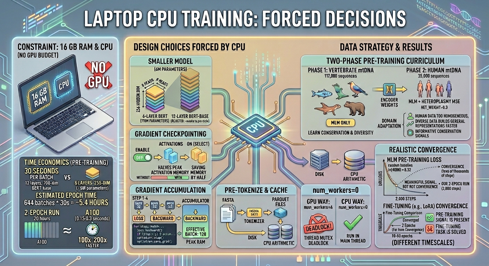

# I'm Training This on a Laptop CPU. Here Is What That Forces Me to Do.

This project started with a constraint: no GPU budget. Not "I'll optimize later if the GPU runs slowly." Just no GPU. The laptop has a CPU and 16 GB of RAM, and that is what I'm training on.

That constraint shapes every decision about model size, data strategy, and what "pre-training" means in practice. This post is about those decisions, with the actual numbers.



---

## What 30 Seconds Per Batch Means

The pre-training dataset is 152,590 genomes total: 117,615 cross-species vertebrate sequences for Phase 1, 34,975 human HmtDB sequences for Phase 2. After sliding-window tokenization (window size 512, stride 256), each genome becomes multiple 512-token windows.

For each batch of 32 windows on this model (6 layers, 8 heads, 256 hidden dim, ~5.8M parameters), a full forward and backward pass takes approximately 30 seconds on the CPU.

Working through the math:

- Batches per epoch: roughly 644 (at batch_size=32, 20,608 windows)
- Time per epoch: 644 batches * 30 seconds = 19,320 seconds = about 5.4 hours
- At batch_size=32 with 4-step gradient accumulation (effective batch 128): 2 epochs = approximately 20 hours

For comparison: the same run on an A100 GPU would take roughly 6 minutes. The GPU is 100-200x faster. This is not a rounding error. It is the actual state of the project.

I'm not trying to hide this. CPU-only training is slow, and the first thing it forces you to do is be explicit about what you can realistically train to convergence.

---

## Design Choices Forced by CPU

**Smaller model.** A 12-layer, 768-dim BERT-base would have approximately 110M parameters, roughly 18x more than what I'm using. Holding everything else constant, that would push per-batch time to over 8 minutes and make a 2-epoch pre-training run take weeks. I chose 6 layers, 256 hidden dim, ~5.8M parameters specifically because a 20-hour run is something I can actually complete.

**Gradient checkpointing.** Implemented via `model.gradient_checkpointing_enable()`, which trades compute for memory by recomputing intermediate activations during the backward pass rather than storing them. This roughly halves peak activation memory. On a 5.8M model this matters: without it, a batch of 32 sequences at 512 tokens each requires keeping all 6 transformer layers' activations in memory simultaneously.

**Gradient accumulation.** The effective batch size I want for stable MLM training is 128. Physically running a batch of 128 windows would require 4x more peak RAM than a batch of 32. Instead, I accumulate gradients over 4 steps (each with batch_size=32) before updating weights. The model sees the same effective batch of 128 windows, but peak memory is that of 32. The training loop looks like:

```python
for step, batch in enumerate(train_loader):
    loss = model(**batch).loss / gradient_accumulation_steps
    loss.backward()
    if (step + 1) % gradient_accumulation_steps == 0:
        optimizer.step()
        optimizer.zero_grad()
```

**Pre-tokenize and cache to disk.** Tokenizing the raw FASTA sequences during training adds overhead to every epoch. Instead, the preprocessing pipeline tokenizes all sequences once and writes them to Parquet files. Each training step loads pre-computed token ID tensors from disk, which is fast enough that data loading is not the bottleneck on CPU. The bottleneck is transformer matrix multiply, not I/O.

**num_workers=0.** A standard optimization for GPU training is setting `num_workers=4` in the DataLoader to parallelize data loading. On CPU-only training, this backfires: the transformer arithmetic is the bottleneck, not data loading, and on Linux, PyTorch's DataLoader uses `fork()` to spawn worker processes. The forked children inherit the parent's memory-resident PyTorch thread mutexes in a locked state, causing the workers to deadlock. The fix is `num_workers=0`: run data loading in the main thread.

---

## Two-Phase Pre-training: Why Start Broad

The training strategy is not "train on human mtDNA sequences" from the start. It is two phases:

**Phase 1: 117,000 cross-species vertebrate mtDNA genomes, het_weight=0.0, MLM only.**

Vertebrate mitochondria all use the same basic genome structure: 13 protein-coding genes, 22 tRNA genes, 2 rRNA genes, and the D-loop control region. The sequences are highly diverse (fish vs. birds vs. mammals span hundreds of millions of years of evolution), but the functional architecture is conserved. Training on this diversity teaches the model what "conserved versus variable" means in mtDNA, what typical codon positions look like, where tRNA structures appear, and what the D-loop region looks like across species.

**Phase 2: 34,975 human HmtDB genomes, het_weight=0.3, MLM + heteroplasmy MSE.**

Phase 2 loads the Phase 1 encoder weights and continues training on human sequences only, now with the heteroplasmy regression head active. The fresh optimizer state means Phase 2 is a proper domain adaptation, not a continuation of Phase 1's learning trajectory. The het_weight=0.3 means 70% of the gradient signal comes from MLM (sequence reconstruction) and 30% from predicting heteroplasmy levels.

Why start broad instead of training on human data from scratch? Three reasons. First, human mtDNA sequences are homogeneous: only 34,975 human genomes were used from HmtDB after quality filtering, and they differ at relatively few positions. Without pre-training on diverse vertebrate sequences, the model's pre-training objective is too easy and the representations too narrow. Second, evolutionary conservation signals from cross-species data are directly informative about which positions matter functionally. Third, it is more compute-efficient: Phase 1 on diverse data builds general representations faster than Phase 2 alone would have to.

This is the same curriculum logic as large language models trained on broad internet data before being fine-tuned on specific domains. Breadth first, depth second.

---

## What You Can Realistically Learn in 2 Pre-training Epochs

MLM pre-training convergence on BERT-scale models typically requires tens of thousands of gradient steps. At my training speed, I can run approximately 1,300 steps per epoch, or roughly 2,600 steps total for a 2-epoch run.

What does that buy? The loss starts near the random baseline of ln(4096) ≈ 8.32, which is what you get from uniform prediction across all 4,096 6-mers. After 2 epochs, the loss should decrease substantially, showing the model has learned something about sequence context. Zero-shot k-NN experiments on the Phase 1 checkpoint showed 16% accuracy versus 10% random. Meaningful signal, but not convergence.

What 2 epochs does not buy is fine-tuning convergence. LoRA fine-tuning on haplogroup classification or variant pathogenicity typically converges in 10-50 epochs. I ran 2 fine-tuning epochs. The math is: training loss dropped by a small amount from the baseline, which means the model was still in the early part of its learning curve when I stopped.

This is the gap between "pre-training signal is present" and "fine-tuning task is solved." They are different convergence timescales.

---

## What Comes Next

The CPU constraint is real and the convergence is partial. The pre-training results are promising enough to proceed, but the fine-tuning story is messier, and the accuracy numbers are lower than what a fully converged model would produce, and sorting out which part of that is the model and which part is the training budget is its own problem. I'll get to that.

The pre-training run itself is a success at what it was supposed to do: verify that the architecture is correct, that the combined loss works, that the representations have meaningful structure, and that the circular PE and het channel are functioning. The scale question is what happens when compute is not the bottleneck.
<!-- published: https://rokpayprsizors.wordpress.com/2026/06/04/im-training-this-on-a-laptop-cpu-here-is-what-that-forces-me-to-do/ -->
