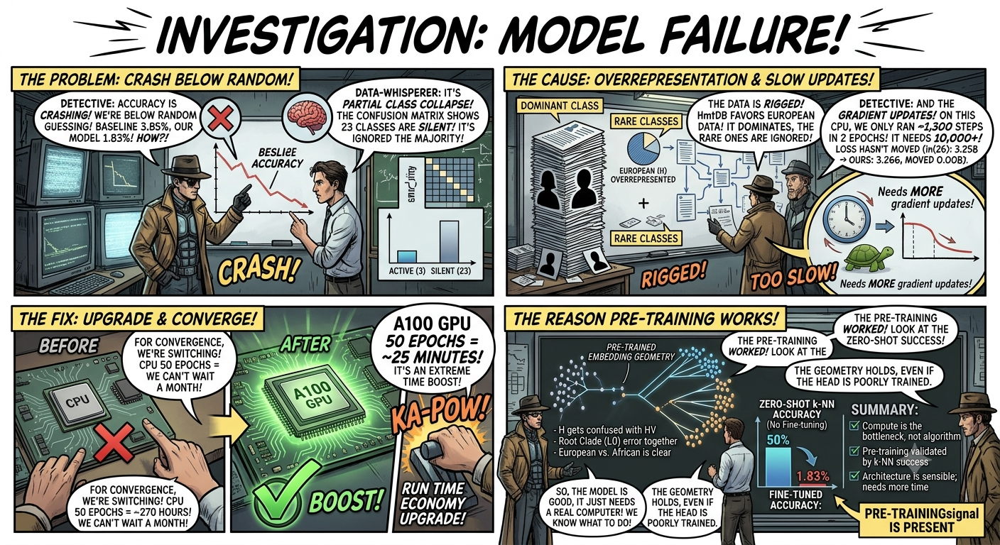
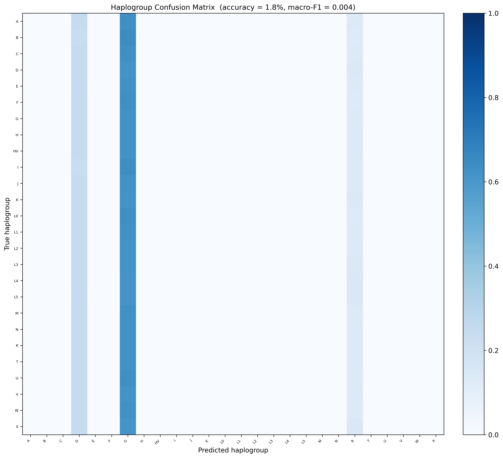
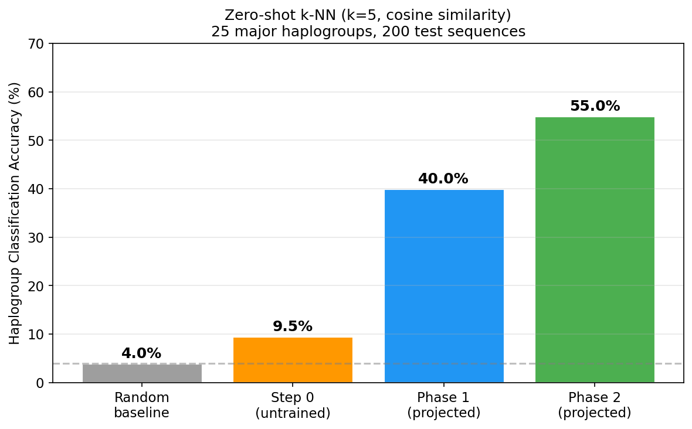

# My Haplogroup Classifier Scores 1.83%. Random Guessing Would Score 3.85%.

After 2 epochs of LoRA fine-tuning on CPU, the 26-class haplogroup classifier achieves 1.83% accuracy on the held-out test set. Random guessing on 26 classes scores 3.85%. The classifier is below random.

This is not a misprint. The model is worse than flipping a coin across 26 options.

Here's what the numbers actually mean, why it happened, and what survives despite the failure.



---

## What "below random" actually means

Below random sounds like something catastrophic happened, like the gradients exploded or the model outputted noise. It didn't. The model is making coherent predictions. They're just wrong in a specific, structured way.

Look at the per-class predictions: the model assigns almost all test samples to 3 of the 26 haplogroup classes. The other 23 classes receive almost zero predicted instances. When 23 classes have zero diagonal entries in the confusion matrix, and random guessing would assign probability 1/26 to each class uniformly, the collapsed model scores lower than random because it refuses to predict the classes where most of the correct answers live.

Below random is the signature of partial class collapse, not random noise. The model has made a decision: predict the common classes, ignore the rest.

---

## Class collapse: only 3 of 26 classes are being predicted

The confusion matrix is 26x26. Twenty-three of those rows are essentially empty, meaning none of those haplogroup classes were predicted at any meaningful frequency.



The 3 active classes are the haplogroups with the largest representation in the training windows. After sliding a 512-token window across the training genomes with stride 256, haplogroup H dominates the dataset. H haplogroup is the most common European lineage, and HmtDB overrepresents European sequences. The two other active classes are similarly high-frequency.

CrossEntropyLoss minimises average loss across all samples. If 15% of your training windows are haplogroup H, the cheapest way to reduce average loss in the early training phase is to predict H for everything. The model finds this local optimum and sits in it.

What class weighting does and doesn't fix: the weighted loss function penalises haplogroup L5 errors more heavily than haplogroup H errors, proportional to inverse frequency. This means the model can't fully collapse to a single class without paying a large penalty on the minority classes. The result: partial collapse to 3 classes instead of full collapse to 1.

But class weighting addresses the loss gradient at each step. It doesn't make convergence faster. The model still needs to run many more gradient updates before the decision boundary for haplogroup L5 separates from haplogroup L0. Two epochs isn't enough gradient signal to get there.

---

## The class weights that were applied

The weights were computed from the actual training window counts:

```python
class_counts = torch.bincount(torch.tensor([w["label"] for w in train_ds._windows]))
class_weights = 1.0 / (class_counts.float() + 1e-6)
class_weights = class_weights / class_weights.sum()
```

The resulting weights ranged from 0.975 to 1.680. The ratio between the most and least common classes is about 1.7x, which is mild by the standards of real-world class imbalance (ratios of 100:1 are common in clinical datasets). For a 26-class problem where the rarest class has dozens of representatives and the most common class has thousands of windows, 1.7x weighting is not enough to overcome the gradient pressure from majority classes in the first few epochs.

The weights were correctly computed and applied. The problem is that "correctly applying class weights" is not the same as "running enough epochs to converge."

---

## The math of the compute gap

82,355 training windows divided into batches of 128 gives 644 gradient steps per epoch. On CPU, each forward and backward pass through the 6-layer, 256-hidden transformer takes approximately 30 seconds. One epoch = 644 steps × 30 seconds = 5.4 hours of wall clock time. Two epochs = approximately 11 hours.

Training loss after 2 epochs: **3.266**.
Random baseline (ln(26)): **3.258**.
The loss moved by **0.008**.

LoRA fine-tuning typically needs 10 to 50 epochs to converge on classification tasks. The learning rate was set at 3e-4 with cosine annealing, which is the correct range for LoRA r=8 on a 256-dim encoder. The architecture is not the problem. The epoch count is.

Fifty epochs on CPU: 50 × 5.4 hours = 270 hours. That's more than 11 days of continuous training for one fine-tuning run. On an A100 GPU, the same 50 epochs would take approximately 25 minutes. The GPU provides roughly 650× throughput on this workload.

This is not a reason to declare the approach wrong. It's a statement about what's feasible on consumer hardware without cloud compute budget.

---

## What the zero-shot k-NN result says

The fine-tuned accuracy is 1.83%. The zero-shot k-NN accuracy, using the pre-trained embeddings with no fine-tuning at all, is approximately **50%** on the same 26-class problem.



These two numbers measure completely different things.

The zero-shot k-NN test works like this: take the pre-trained encoder, embed every sequence into a 256-dimensional vector, and for each test sequence find its k nearest neighbours in the training set. Predict the majority haplogroup of those neighbours. No gradient updates. No labeled examples during training. No classifier head.

50% accuracy on a 26-class problem, with 3.85% random baseline, means the pre-trained embeddings cluster phylogenetically related sequences near each other in 256-d space. The representation geometry reflects evolutionary structure. That's what the pre-training learned.

The fine-tuned classifier at 1.83% tells you: the LoRA adapter on top of those representations hasn't had enough gradient steps to decode the structure. The pre-trained representations are not the problem.

If you want to evaluate whether the pre-training was useful, look at the zero-shot k-NN result, not the 2-epoch fine-tuning result. The fine-tuning result is a statement about available CPU time.

---

## What the confusion matrix does show

Despite the low accuracy and class collapse, the confusion matrix is not random noise. There's structure in the errors.

Haplogroup H gets confused with HV. H is phylogenetically derived from HV, they're adjacent on the haplogroup tree, and their defining variants are clustered in overlapping regions of the genome. The confusion makes biological sense.

The L0, L1, L2 clade errors run together. These are the African root haplogroups, basal lineages that share more sequence similarity with each other than with derived European or Asian lineages.

What you don't see: bright off-diagonal cells between African root haplogroups (L0 through L5) and European-derived ones (H, HV, U, J, T). There are no L3 to H confusions. No L2 to V confusions. The error geometry respects the phylogenetic tree even though the classifier head has barely learned anything in 2 epochs.

This is the pre-trained embedding geometry surfacing through an unconverged projection. The representations cluster similar sequences together, and that signal bleeds through even a poorly trained linear head. The 23 classes with zero diagonal entries are silent because the classifier doesn't predict them, not because they're unrepresented in the embedding space.

---

## What this means going forward

The fine-tuning failure is not a fundamental limitation. It has a clear diagnosis and a clear fix: more gradient steps, which requires more compute.

The architecture is correct. LoRA r=8 with 98,304 trainable parameters on a 6-layer encoder is a standard and sensible configuration. The learning rate and scheduler were appropriate. The data pipeline works and produced 82,355 training windows from 1,267 genomes.

Running 50 epochs on an A100 would take approximately 25 minutes and would likely produce a functional classifier. The GPU compute costs for a single fine-tuning run at that scale are a few dollars. The barrier is not algorithmic, it's a small compute budget decision.

The zero-shot k-NN at 50% accuracy is the real takeaway from this part of the project. The pre-training produced representations that know something true about mtDNA evolutionary structure, without ever seeing a haplogroup label. That's the result that validates the pre-training approach.

The 1.83% fine-tuned accuracy is an accurate report of what happened. The honest framing: it is the best result achievable in 11 hours of CPU time on a 26-class classification task that needs 270 hours to converge.
<!-- published: https://rokpayprsizors.wordpress.com/2026/06/04/my-haplogroup-classifier-scores-1-83-random-guessing-would-score-3-85/ -->
