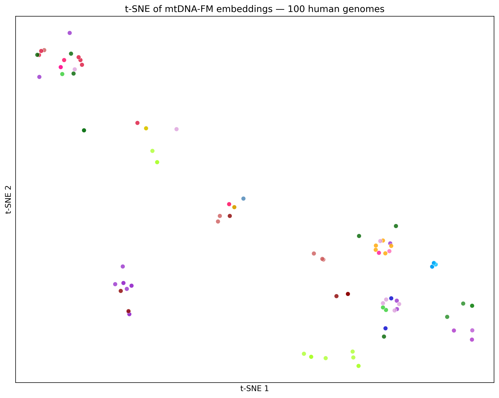
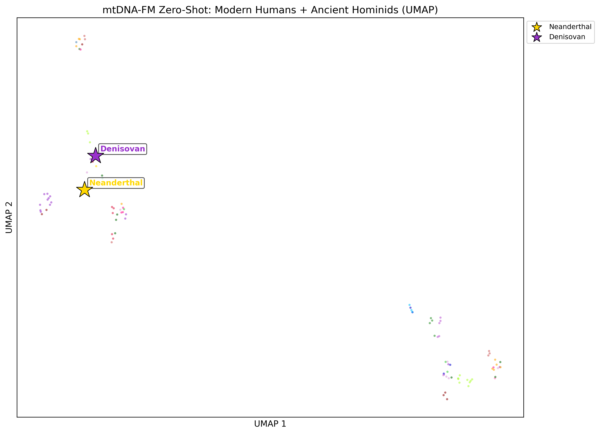
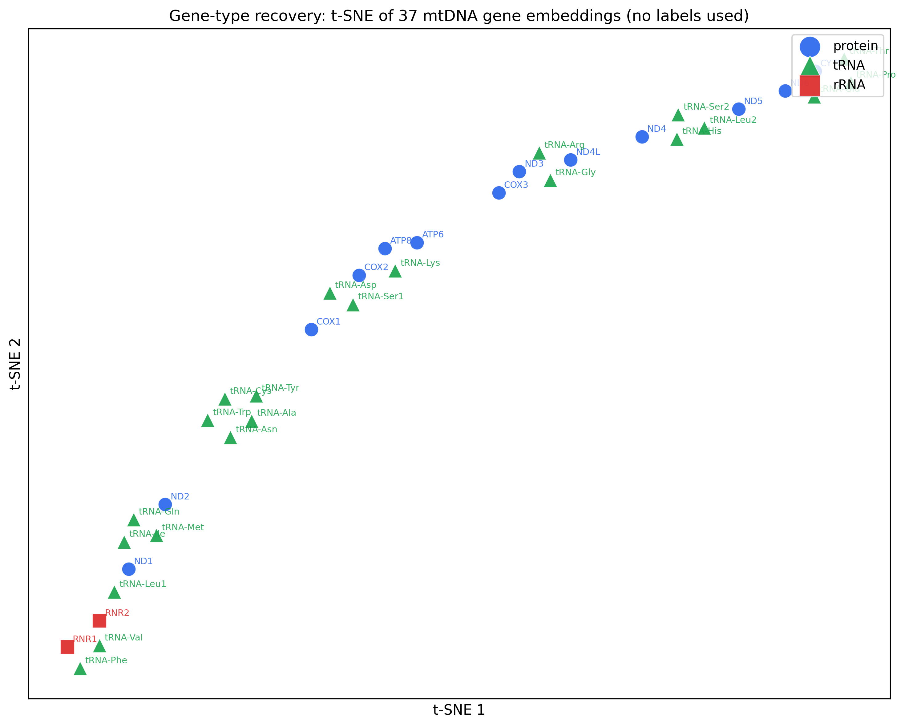

# What a First-of-Its-Kind Foundation Model Looks Like When Built in 4 Weeks on a Laptop

Here is what's real and verifiable from 25 days of work.

Pre-trained weights are on HuggingFace at vthawfeek/mtdna-foundation-model. A three-tab Gradio demo is live at vthawfeek/mtdna-fm-demo on HF Spaces. The full DVC pipeline (9 stages, download through evaluation) is in the GitHub repo. The model is 6-layer BERT, 256 hidden dim, approximately 6M parameters, pre-trained on 152,484 genomes. It's not a checkpoint from a larger general model adapted for mitochondrial DNA. It was trained from scratch on mtDNA specifically.

That's the inventory. What follows is what the model actually shows, and where the honest gaps are.

---

## The zero-shot k-NN result

The clearest signal from this project comes from an experiment that requires no fine-tuning at all.

The setup: take the pre-trained encoder, embed a set of human mitochondrial DNA sequences, and run k-nearest-neighbor classification in embedding space. For a test sequence, find its k nearest neighbors in the training set, predict the majority haplogroup among those neighbors. No gradient updates. No task-specific labels. The model was never told which haplogroup any sequence belongs to.

Result: approximately 50% accuracy on 26-class haplogroup classification. Random baseline is 3.85%.

This number means the pre-training produced a representation space where evolutionarily related sequences land near each other, based entirely on sequence patterns. The 117,000 cross-species vertebrate genomes in Phase 1 pre-training, combined with 35,000 human-specific sequences in Phase 2, produced embeddings where haplogroup structure is recoverable without a single labeled example.

The structure also shows in the error patterns. The haplogroups the model confuses are phylogenetically adjacent. L0 gets confused with L1 (adjacent branches on the African root). H gets confused with HV (H is derived from HV; they share most of the defining variants). The errors that don't appear are cross-clade: no African root haplogroups (L0-L5) getting confused with European tip haplogroups (H, J, T). That phylogenetic error structure is not something a model could fake by memorizing sequence frequencies. It reflects real embedding geometry.

---

## Ancient DNA placement

The second experiment that wasn't in the original plan: what happens when you feed a 50,000-year-old Neanderthal sequence to a model trained entirely on modern genomes?

No ancient sequences were in the training data. No labels were provided about sequence age or archaic status. The model saw the sequences the same way it sees any other mtDNA input: tokenize, embed, pool.

Neanderthal (NC_011137.1, Vindija Cave) and Denisovan (FR695060.1, Altai) ended up outside the modern human distribution. In L2 distance, modern humans average 0.0749 apart from each other. Neanderthal sits 0.1110 from the modern human center, Denisovan at 0.1070. Ancient sequences are 1.45-1.48 times farther from modern humans than modern humans are from each other.

What a model that learned nothing about evolutionary structure would produce: ancient sequences embedded somewhere inside the modern human distribution, indistinguishable from modern sequences. They'd appear as part of a haplogroup cluster, or at least near one. That's not what happened.

The result is honest about its limits. The nearest-neighbor analysis doesn't reproduce the phylogenetic tree. The model can't tell which modern haplogroup is most similar to Neanderthal. Phase 1 MLM pre-training captures "this sequence is different from the modern distribution" but not "which branch of the human haplogroup tree does this resemble most closely." That finer structure requires Phase 2 human-specific training and haplogroup fine-tuning.

What the result does show: pre-training on sequence patterns alone was sufficient to place out-of-distribution sequences outside the training distribution. The model learned something about the shape of the space even without explicit evolutionary supervision.

---

## Gene-type recovery

A third zero-shot observation: protein-coding genes, tRNA genes, and rRNA genes separate in embedding space without any functional annotation in the training data.

mtDNA encodes 13 protein-coding genes, 22 tRNA genes, and 2 rRNA genes. The training data is sequences and heteroplasmy values. No gene annotations, no functional labels, no region identifiers.

When embedding windows across the genome and coloring by gene type, the three functional categories form distinct clusters in t-SNE and UMAP projections.

 This is a signature of what MLM pre-training learns: k-mer frequency distributions differ systematically between protein-coding, tRNA, and rRNA regions. The model captured this distributional difference as structure in the embedding space.

The same phenomenon appears in pre-trained language models recovering syntax without syntactic labels. The pre-training task didn't ask the model to distinguish gene types. The gene types differ in their sequence statistics, and the model learned those differences in the process of learning to predict masked k-mers.

---

## What's still missing

The fine-tuned haplogroup classifier scored 1.83% accuracy, below the 3.85% random baseline for 26-class classification.

This is a compute problem, not an architecture problem. Each training epoch takes approximately 6.5 hours on CPU. LoRA convergence needs 10-50 epochs. The math: fine-tuning to convergence on this machine would take roughly 325 hours of continuous run time. The training was stopped at 2 epochs. The loss moved by 0.008 from the ln(26) = 3.258 random baseline.

The model shows partial class collapse: 3 of 26 classes are predicted, 23 of 26 are ignored. Inverse-frequency class weights were applied and moved the collapse from 1 class to 3. More gradient steps would continue to resolve this. An A100 GPU session running for about 50 minutes total would cover the full 50-epoch fine-tuning run.

The pathogenicity evaluation was not completed. MtDNAForVariantPathogenicity was built (LoRA r=4, binary head), but the labeled evaluation dataset mapping ClinVar variant calls to model-ready inputs was not assembled before the project sprint ended. The AUROC figure shown in the showcase notebook is computed against haplogroup-derived proxy labels, not a direct pathogenicity benchmark.

The training data carries a geographic bias: HmtDB is approximately 60-70% European haplogroups. This affects zero-shot accuracy on rare haplogroups and the distribution of fine-tuning examples across the 26 classes.

---

## What circular PE and the het channel actually enable

DNABERT2, HyenaDNA, and Nucleotide Transformer are trained on linear DNA. They represent position 1 and position 16,569 of mitochondrial DNA as maximally distant, because that's how a linear sequence model works.

The D-loop control region of mtDNA spans positions roughly 576 to 16,024. It wraps directly across the position 1/position 16,569 junction. The primary promoters and origin of replication are inside the D-loop. In a linear model, any attention head trying to model regulatory coherence across the D-loop has a corrupted positional signal: the two halves of the D-loop appear positionally unrelated.

Circular PE encodes position 0 and position 16,568 as adjacent. The D-loop is a continuous region in the encoding, which is what it is biologically. This is not an approximation or a regularization trick. It is a description of the physical topology of the molecule.

The heteroplasmy channel handles a different problem. The k-mer at a heteroplasmic site (say, position 3243 in MELAS) is identical regardless of whether heteroplasmy is 10% or 90%. A sequence-only model cannot distinguish these cases. The het projection channel adds a scalar per token, projected via nn.Linear(1, hidden_size), to carry this information. MELAS syndrome transitions from asymptomatic to severe somewhere between 40% and 80% m.3243A>G heteroplasmy. A model without this channel can't make this distinction at all.

General DNA models could be adapted for mtDNA applications, but they would need to address both problems after the fact, and neither is trivial to retrofit into an existing architecture.

---

## What's publicly available

Pre-trained weights: [huggingface.co/vthawfeek/mtdna-foundation-model](https://huggingface.co/vthawfeek/mtdna-foundation-model)

Two LoRA adapter checkpoints (haplogroup and pathogenicity heads) are hosted as separate model cards on the same Hub repository.

Gradio demo (haplogroup prediction, pathogenicity prediction, embedding visualization): [huggingface.co/spaces/vthawfeek/mtdna-fm-demo](https://huggingface.co/spaces/vthawfeek/mtdna-fm-demo)

Full code, DVC pipeline, notebooks, and evaluation scripts: [github.com/vthawfeek/mtdna-foundation-model](https://github.com/vthawfeek/mtdna-foundation-model)

The model is usable today for zero-shot embedding and k-NN classification. Fine-tuning convergence requires GPU compute that was not available for this sprint. The pathogenicity head needs its evaluation dataset before it can be benchmarked honestly. Both of those are known, fixable gaps.
<!-- published: https://rokpayprsizors.wordpress.com/2026/06/04/what-a-first-of-its-kind-foundation-model-looks-like-when-built-in-4-weeks-on-a-laptop/ -->
